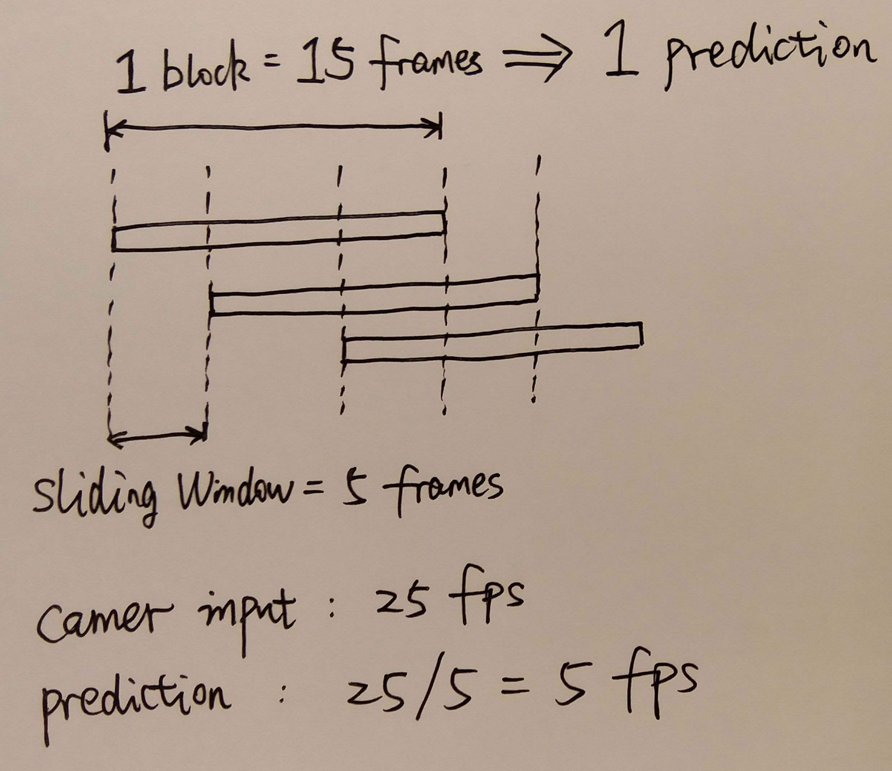

# Real-time-Action-Recognition_TX2
A real-time action recognition demo on Nvidia Tegra X2 using CSI cameras. The CNN is trained on KTH dataset. The system is built on ROS.

---
<br>

## Prerequisite
* Harware: Nvidia TX2
* Softwares: opencv-python, pytorch, ros
* Packages: skimage, numpy, scipy
* Specially, my environment: 
  opencv 3.4.6 (not the ROS built-in one), torch 1.0.0, ROS kinetic, scikit-image 0.15.0, numpy 1.15.4, scipy 1.12.7

---
<br>

## Packages building: ROS + python3 + cv_bridge/cv2 
The ROS build-in cv2/cv_bridge are both python2-based but torch needs python3. To solve the problem, I personally install the python3 version cv2/ cv_bridge and use the python2/python3 mixture environment.  

* First make a soft link, since TX2 is aarch64-based and there is no folder called `/usr/lib/x86_64-linux-gnu`.
  ```bash
  mkdir -p /usr/lib/x86_64-linux-gnu
  sudo ln -s /usr/lib/aarch64-linux-gnu/libboost_python-py35.so.1.58.0 /usr/lib/x86_64-linux-gnu/libboost_python3.so
  sudo ln -s /usr/lib/aarch64-linux-gnu/libpython3.5m.so /usr/lib/x86_64-linux-gnu/libpython3.5m.so
  ```
* Then run the script to automatically build packages: `./build.sh` 
* During using, the starter of `.py` file should be similar to:
  ```python
  #!/usr/bin/env python3
  import sys, os
  ros_path = '/opt/ros/kinetic/lib/python2.7/dist-packages'
  cv_bridge_path = '/home/nvidia/Desktop/ti_ros/devel/lib/python3/dist-packages' # change this to your ros workspace folder
  
  if ros_path in sys.path:
      sys.path.remove(ros_path)
  if cv_bridge_path not in sys.path:
      sys.path.append(cv_bridge_path)

  from cv_bridge import CvBridge, CvBridgeError
  import cv2
  sys.path.append('/opt/ros/kinetic/lib/python2.7/dist-packages')
  ```
---
<br>

## Running
`roslaunch jetson_csi_cam jetson_csi_cam.launch`,  
`roslaunch action_recognition action_recognition.launch`

---
<br>

## Appendix  
### Model training
The model is trained followed the guide of [Action Recognition on the KTH dataset](https://github.com/vkhoi/KTH-Action-Recognition). Note that KTH dataset only covers 6 actions.   
I use the model `CNN on block of frames + optical flow`. Go to [evaluation directory](./Evaluation) for details.
* A comment here is that the above scripts will lead high training memory usages, because it loads the dataset when the dataloader class is constructed, rather than gradually fetches the training data by running `__getitem__`.

### Video capturing
See: http://petermoran.org/csi-cameras-on-tx2/. This works for the TX2 onboard camera as well as other CSI cameras.

### Predictions generation
<p align="left">
	
</p>

### Others
Make sure that every scipt obtains the execution permission before running them.

